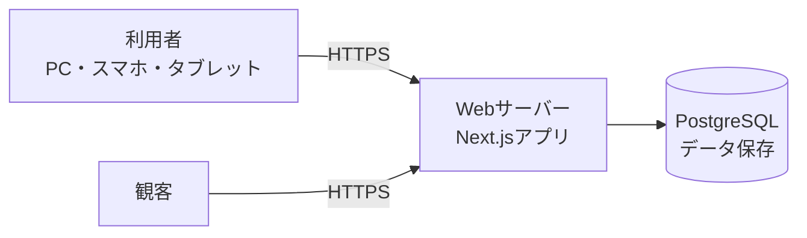

# インフラ構成

ROBOPOは **インターネット上のサーバーでアプリが動き、手元のスマホ・PCのブラウザから利用する** 構成になっています。

## 本番環境

- **URL**: [https://robopo.caravan-kidstec.com](https://robopo.caravan-kidstec.com)
- **アプリサーバー**: クラウド上で動作するWebサーバー
- **データベース**: PostgreSQL
- **HTTPS**: 通信はすべて暗号化されています

## 構成イメージ

## 処理の流れ

1. 利用者がブラウザでROBOPOのURLを開きます
2. Webサーバー上で動くNext.jsアプリが画面を返します
3. 大会・選手・得点などのデータは、PostgreSQLに保存されます
4. 観客の観戦ページも同じサーバーからデータを取得します

## マニュアルサイトの構成

このマニュアルサイト（今ご覧のページ）は、**アプリ本体とは別のホスティング** に配置されています。

- アプリ本体: `https://robopo.caravan-kidstec.com`
- マニュアル: GitHub Pages で配信

## 可用性・安定性

- サーバーはクラウド上で稼働しているため、会場のネットワーク障害の影響を受けにくい
- HTTPSで通信はすべて暗号化されています
- データベースは **定期バックアップ** を推奨（大会前・大会後）

## ネットワーク要件

- 採点・観戦ともに、端末から本番サーバーへ **インターネット通信できる環境** が必要です
- 会場のWi-Fiが不安定な場合は、モバイル回線を併用するなどの対策をご検討ください

:::caution[オフライン時の挙動]

ROBOPO は現在 **オフライン動作には対応していません**。採点者の端末がインターネットから切断された場合:

- 採点結果の送信（結果送信ボタン押下時）は失敗します
- 再接続後に再送信する必要があります
- 進行中の採点データ（ミッション判定中の状態）はブラウザ側に一時的に保持されていますが、**画面をリロードすると失われます**

大会運営中はネットワーク接続を安定させることを強くおすすめします。

:::
