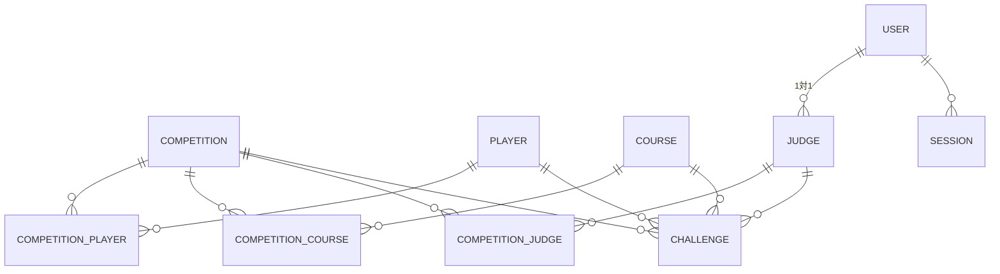

# データ構造

ROBOPOはすべてのデータをPostgreSQLデータベースに保存します。ここでは、非エンジニア向けに「どんな情報が、どうつながっているか」を説明します。

## 全体のつながり

## 主な情報のかたまり

### 1. 基本となる4つのテーブル

| 名前 | 内容 |
| --- | --- |
| **大会 (competition)** | 大会名・開催日時・終了日時・説明・マスク設定 |
| **コース (course)** | コース名・フィールド配置・ミッションリスト・配点・コースアウトルール |
| **選手 (player)** | 氏名・ふりがな・ゼッケン番号・備考 |
| **採点者 (judge)** | 採点者 (user アカウントと1対1で紐付く) |

:::info[フィールドとミッションはコーステーブルの中]

「フィールド配置」「ミッションリスト」「配点」は、**コーステーブル1つの中に文字列として保存** されています。別テーブルではありません。配列を文字列にまとめてデータベースに入れることで、1つのコースが1行で完結するシンプルな構造になっています。

:::

### 2. 紐付け用のテーブル（多対多）

大会と選手・コース・採点者は「多対多」の関係です（1つの大会に複数の選手、同じ選手が複数の大会に参加可能）。これを表現するため、中間テーブルがあります。

| 名前 | 何を紐付ける？ |
| --- | --- |
| **competition_player** | 大会 ↔ 選手 |
| **competition_course** | 大会 ↔ コース |
| **competition_judge** | 大会 ↔ 採点者 |

### 3. 採点記録テーブル

| 名前 | 内容 |
| --- | --- |
| **挑戦 (challenge)** | 1人の選手の1コースに対する1つの採点記録（1回目+2回目まとめて1行） |

挑戦テーブルの主な列:
- `first_result`: 1回目の結果（到達したミッション番号）
- `retry_result`: 2回目の結果（再挑戦していなければ NULL）
- `detail`: コースアウトなどの追加情報
- 外部キー: competition_id, course_id, player_id, judge_id

### 4. 認証関連テーブル（Better Auth が自動管理）

| 名前 | 内容 |
| --- | --- |
| **user** | ログインできるすべてのユーザー（管理者・採点者） |
| **session** | ログインセッション |
| **account** | 認証プロバイダ情報 |
| **verification** | 確認コード等 |

採点者テーブル (judge) は user テーブルと1対1で紐付いており、user テーブルに判定者レコードがあれば「採点者」、なければ「管理者」と判別されます。

## 具体例

「大会A」に「選手B」が参加し、「コースX」を「採点者C」の採点で走行したとします。

1. **大会A** レコードが作られる（competition テーブル）
2. **選手B** レコードが作られる（player テーブル）
3. **コースX** レコードが作られる（course テーブル。フィールドとミッションはこの行の文字列フィールドに格納）
4. **採点者C** の user アカウント + judge レコードが作られる
5. **competition_player** に「大会A ↔ 選手B」の紐付けレコード
6. **competition_course** に「大会A ↔ コースX」の紐付けレコード
7. **competition_judge** に「大会A ↔ 採点者C」の紐付けレコード
8. 選手Bが走行するたび、**challenge** に1行ずつ追加される
9. 2回目に挑戦した場合、1回目と同じ challenge 行の `retry_result` が更新される

## 集計の仕組み

個人成績シートや集計結果を表示するときは、データベースから

1. 選手情報
2. その選手のコースごとの挑戦レコード（複数）
3. コース情報（ミッション・配点を含む）

を取得し、**コース単位で最高得点の試行を選んで集計** します。1回目と2回目のうち高い方が記録に反映されます。

## バックアップ

PostgreSQL の `pg_dump` を使って定期バックアップを取得することを推奨します。

- 大会開始前と終了後のバックアップは必須
- 大会中も数時間ごとにバックアップを取ると安心
